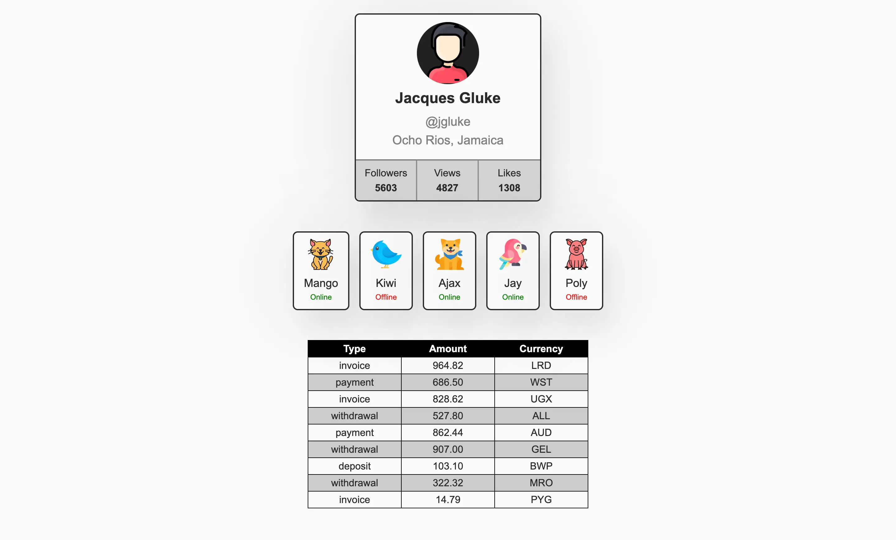

# React Components

## Module 1: Components, Props, Vite

## Functionality Summary

This repository contained the implementation of a movie search application using React with routing. The project was created with Vite, utilized React Router for routing, Axios for HTTP requests, and styled components with CSS modules. The application had several key functionalities, which are summarized below:

### Profile Component

The `Profile` component displays user information including their name, tag, location, avatar, and activity stats.

- **Props**:
  - `name`: User's name.
  - `tag`: User's social media tag.
  - `location`: User's location.
  - `image`: URL of the user's avatar.
  - `stats`: Object containing user activity statistics (followers, views, likes).

### FriendList Component

The `FriendList` component displays a list of friends, each represented by a `FriendListItem` component.

- **Props**:
  - `friends`: Array of friend objects, each containing an `avatar`, `name`, `isOnline` status, and an `id`.

### TransactionHistory Component

The `TransactionHistory` component displays a table of user transactions.

- **Props**:
  - `items`: Array of transaction objects, each containing an `id`, `type`, `amount`, and `currency`.

## Component Structure

- Each component is organized in its own folder within `src/components`.
- Default exports are used for all components.
- JSON files are used to manage data for components, keeping the main `App` component clean.

## Code Quality

- Ensured no errors or warnings in the console.
- Maintained clean and understandable JavaScript code using Prettier for formatting.
- Styling was performed using CSS modules.

## Live Demo

- **Source Files**: [GitHub Repository](https://github.com/grifano/goit-react-hw-01)
- **Working Page**: [Vercel Deployment](https://goit-react-hw-01-sandy-zeta.vercel.app/)

## Project Setup

1. Clone the repository.
2. Install dependencies: `npm install`
3. Start the development server: `npm run dev`

## Component List

### Profile

- **File Structure**:
  - `src/components/Profile/Profile.jsx`
  - `src/components/Profile/Profile.module.css`
- **Functionality**:
  - Displays user details and activity statistics.
  - Imports user data from `userData.json`.

### FriendList

- **File Structure**:
  - `src/components/FriendList/FriendList.jsx`
  - `src/components/FriendList/FriendList.module.css`
  - `src/components/FriendListItem/FriendListItem.jsx`
  - `src/components/FriendListItem/FriendListItem.module.css`
- **Functionality**:
  - Displays a list of friends with their online status.
  - Imports friend data from `friends.json`.

### TransactionHistory

- **File Structure**:
  - `src/components/TransactionHistory/TransactionHistory.jsx`
  - `src/components/TransactionHistory/TransactionHistory.module.css`
- **Functionality**:
  - Displays a table of transactions.
  - Imports transaction data from `transactions.json`.

## Acknowledgments

[GOIT](https://edu.goit.global/uk/referral?x=eyJlbWFpbCI6InNvcmxlbmtAZ21haWwuY29tIiwiZmlyc3ROYW1lIjoi0KHQtdGA0LPRltC5IiwibG9jYWxlIjoidWsiLCJsYW5ndWFnZSI6InVrIiwidG90YWxIb3VycyI6NzcsImN1cnJlbnRPckxhc3RUZWNobm9sb2d5IjoiSFRNTF9DU1MiLCJwYXNzZWRIb21ld29ya3NDb3VudCI6NX0=) -
big love to GoIT team for their patience, afford, help, and positivity that they
share with us ❤️

## Author

- Website - [www.grifano.com](https://grifano.com)
- Frontend Mentor -
  [www.frontendmentor.com](https://www.frontendmentor.io/profile/grifano)
- LinkedIn - [www.linkedin.com](https://www.linkedin.com/in/grifano/)
